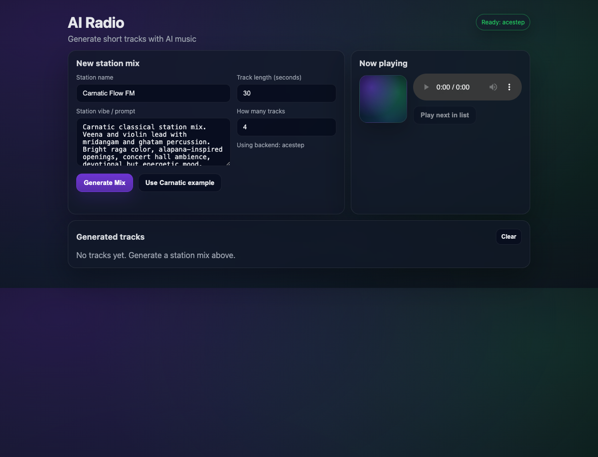

# AI Radio (local)

AI Radio helps you make a short station mix from one prompt.



## 1) Start it (2 minutes)

```bash
npm install
cp .env.example .env
npm run dev
```

Open the URL shown in the terminal (usually `http://localhost:3001`).

## 2) Make your first mix

1. Enter a station name.
2. Enter your vibe prompt.
3. Choose:
   - track length
   - number of tracks
4. Pick a model:
   - ACE-Step (local)
   - ElevenLabs
5. Click **Generate Mix**.
6. Play tracks in the queue and download what you like.

## 3) ElevenLabs key (if you use ElevenLabs)

Paste your ElevenLabs API key in the input and click **Save for session**.

## 4) Quick problems, quick fixes

- Port issue? Change `PORT` in `.env` and restart.
- ACE-Step has a dependency issue? Switch to ElevenLabs and continue.
- Too many tracks too soon? Try fewer tracks or a shorter length.

That’s it. No deep setup required to start using it.
